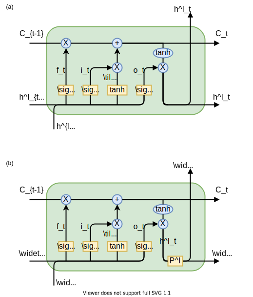
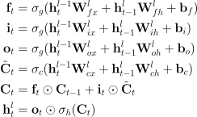
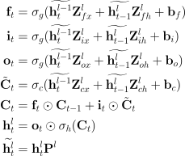

# Compressed Long Short-Term Memory (CLSTM) Documentation

The following Figure from [[1](#1)] shows the standard LSTM cell (a) and its compressed version (b). Furthermore, we provide the [LSTM equations](#lstm-equations) and the [compressed LSTM equations](#compressed-lstm-equations). For more details see [[1](#1)].

## LSTM Equations

## Compressed LSTM Equations

Compared to [[2](#2)]  we change the notation in the following way. For all matrices with subscript x the layer index l is increased by one compared to [[2](#2)]. The matrix vector multiplications are transposed because this is closer to the Keras implementation of LSTMs.

## References
<a id="1">[1]</a> M. Siemering, “**Real-time speech separation with deep attractor networks on an embedded system**,” Nov. 2020.

<a id="2">[2]</a> R. Prabhavalkar, O. Alsharif, A. Bruguier, and L. McGraw, “**On the compression of recurrent neural networks with an application to LVCSR acoustic modeling for embedded speech recognition**,” in 2016 IEEE International Conference on Acoustics, Speech and Signal Processing (ICASSP). IEEE, 2016, pp. 5970–5974. [https://ieeexplore.ieee.org/abstract/document/7472823/](https://ieeexplore.ieee.org/abstract/document/7472823/)